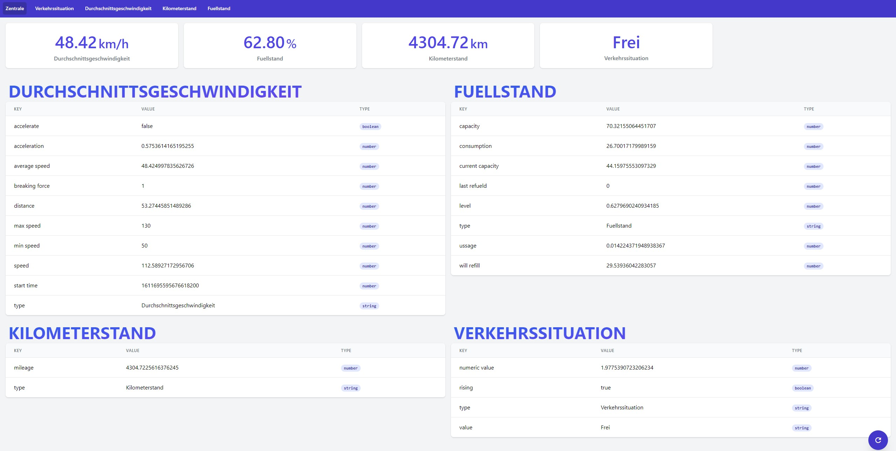

# Distributed Systems

[[_TOC_]]

## Getting Started

Um die container zuerstellen kann es sein das man sich mit `docker login` einloggen muss um das `debian:latest` image herunterladen zu koennen. sollte es bereits vorhanden sein ist die nicht notwendig.

- Start Containers: `docker-compose up --build`
- Start Devcontainers: `docker-compose -f docker-compose.yml -f docker-compose.dev.yml up --build`
- Run Tests: `docker-compose -f docker-compose.yml -f docker-compose.test.yml up --build`

## Architecture

### UDP

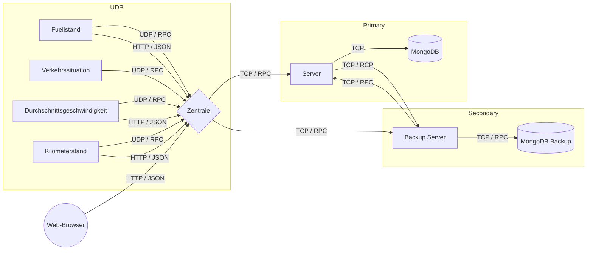

#### Füllstand

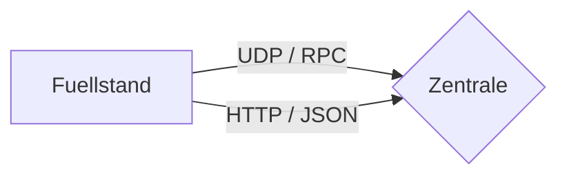

##### UDP / RPC

Der Sensor _Fuellstand_ schickt ein Datagram über UDP and die Zentrale auf **Port 8005**. Der Inhalt des Datagrams ist eine mittels Protocol Buffers serialisierte Nachricht, welche die Messdaten des Sensors beinhaltet, sowie die Verbindungseigenschaften, welche nötig sind um die Nachricht an die Zentrale schicken zu können.

```yaml
Port: 8005
```

```protobuf
message Fuellstand {
    required double capacity = 1;
    required double consumption = 2;
    required double current_capacity = 3;
    required double last_refueld = 4;
    required double level = 5;
    required double ussage = 6;
    required double will_refill = 7;
    required string type = 8;
}
```

- capacity: Kapazität des Tanks
- consumption: Verbrauch seit letzter Messung
- current_capacity: Aktueller Füllstand des Tanks
- last_refueld: Zeitpunkt der letzten Füllung des Tanks in Nanosekunden
- level: Aktueller Füllstand in Prozent (%)
- ussage: Verbrauch auf 100km
- will_refill: Gibt die Prozent an, ab welchem Prozentwert in der Simulation der Tank neu befüllt wird.
- type: Gibt die Art des Sensors an

```protobuf
message FuellstandToHeadquarter {
    required Fuellstand data = 1;
    optional string from_address = 2;
    optional int32 from_port = 3;
    optional string to_address = 4;
    optional int32 to_port = 5;
    required uint64 send = 6;
    optional uint64 received = 7;
    optional uint64 latency = 8;
    optional uint64 round_trip = 9;
}
```

- data: Daten des Sensors
- from_address: Adresse des Senders
- from_port: Port des Senders
- to_address: Adresse des Empfängers
- to_port: Port des Empfängers
- send: Zeitpunkt an dem die Nachricht versendet wird.[^clock]
- received: Zeitpunkt an dem die Nachricht empfangen wird.[^clock]
- latency: Berechnete Latenz zwischen senden und empfangen der Nachricht. [^clock]
- round_trip: Gesamtdauer bis die Nachricht vom ersten Sender gesendet und vom letzten Empfänger empfangen wird.[^clock]

##### HTTP / JSON

Der Sensor _Fuellstand_ fragt in der Simulation die Distanze des Sensors _Durchschnittsgeschwindigkeit_ über die Rest API der Zentrale ab. Um aus der Zurückgelegtendistanze den Verbrauch mittels einem zum Start des Sensors zufällig gewählten Wert für den Verbrauch auf 100km zu berechnen.

```http
GET / HTTP/1.1
```

```json
{
  ...
  "durchschnittsgeschwindigkeit": {
    "accelerate": true,
    "acceleration": 0.16185306522628218,
    "average speed": 43.75087498656756,
    "breaking force": 1,
    "distance": 34.82812203174052,
    "max speed": 130,
    "min speed": 50,
    "speed": 41.7444430884444,
    "start time": 1611301664628575700,
    "type": "Durchschnittsgeschwindigkeit"
  },
  ...
}
```

#### Verkehrssituation

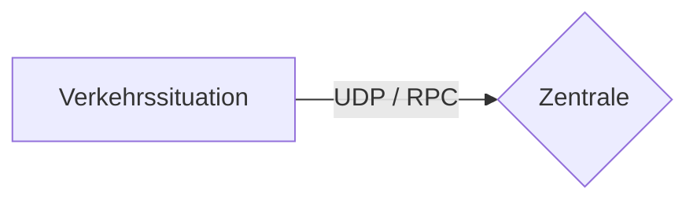

##### UDP / RPC

Der Sensor _Verkehrssituation_ schickt ein Datagram über UDP and die Zentrale auf **Port 8002**. Der Inhalt des Datagrams ist eine mittels Protocol Buffers serialisierte Nachricht, welche die Messdaten des Sensors beinhaltet, sowie die Verbindungseigenschaften, welche nötig sind um die Nachricht an die Zentrale schicken zu können.

```yaml
Port: 8002
```

```protobuf
  message Verkehrssituation {
    required double numeric_value = 1;
    required bool rising = 2;
    required string value = 3;
    required string type = 4;
  }
```

- numeric_value: Numerischer Wert der die Stärke des Verkehrs wiederspiegelt (Frei = 1, Stau = 5).
- rising: Gibt an ob in der Simulation der Verkehr zunimmt oder abnehmt.
- value: Gibt in Textform die Stärke des Verkehrs an (Frei, mäßiger Verkehr, starker Verkehr, Stau).

```protobuf
message VerkehrssituationToHeadquarter {
    required Verkehrssituation data = 1;
    optional string from_address = 2;
    optional int32 from_port = 3;
    optional string to_address = 4;
    optional int32 to_port = 5;
    required uint64 send = 6;
    optional uint64 received = 7;
    optional uint64 latency = 8;
    optional uint64 round_trip = 9;
}
```

- data: Daten des Sensors
- from_address: Adresse des Senders
- from_port: Port des Senders
- to_address: Adresse des Empfängers
- to_port: Port des Empfängers
- send: Zeitpunkt an dem die Nachricht versendet wird.[^clock]
- received: Zeitpunkt an dem die Nachricht empfangen wird.[^clock]
- latency: Berechnete Latenz zwischen senden und empfangen der Nachricht. [^clock]
- round_trip: Gesamtdauer bis die Nachricht vom ersten Sender gesendet und vom letzten Empfänger empfangen wird.[^clock]

#### Durchschnittsgeschwindigkeit

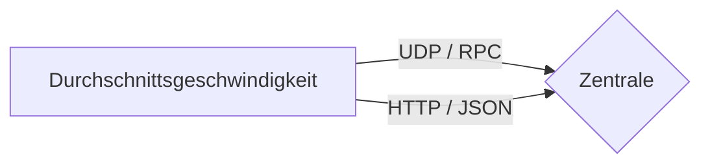

##### UDP / RPC

Der Sensor _Durchschnittsgeschwindigkeit_ schickt ein Datagram über UDP and die Zentrale auf **Port 8003**. Der Inhalt des Datagrams ist eine mittels Protocol Buffers serialisierte Nachricht, welche die Messdaten des Sensors beinhaltet, sowie die Verbindungseigenschaften, welche nötig sind um die Nachricht an die Zentrale schicken zu können.

```yaml
Port: 8003
```

```protobuf
message Durchschnittsgeschwindigkeit {
    required bool accelerate = 1;
    required double acceleration = 2;
    required double average_speed = 3;
    required double breaking_force = 4;
    required double distance = 5;
    required double min_speed = 6;
    required double max_speed = 7;
    required double speed = 8;
    required double start_time = 9;
    required string type = 10;
}
```

- accelerate: Gibt in der Simulation an ob beschleunigt oder gebremst wird.
- acceleration: Gibt die Be- und Entschleunigung an.
- average_speed: Gibt die Durchschnittsgeschwindigkeit in km/h an.
- breaking_foce: Aktuelle Bremskraft
- distance: Gibt die zurückgelegte Strecke in km an.
- min_speed: Gibt in der Simulation die untere Schranke für die Geschwindigkeit an, abhängig von der Verkehrssituation.
- max_speed: Gibt in der Simulation die obere Schranke für die Geschwindigkeit an, abhängig von der Verkehrssituation.
- start_time: Gibt den Zeitpunkt an an dem der Sensor das erste mal einen Wert gemessen hat.
- type: Gibt die Art des Sensors an.

```protobuf
message DurchschnittsgeschwindigkeitToHeadquarter {
    required Durchschnittsgeschwindigkeit data = 1;
    optional string from_address = 2;
    optional int32 from_port = 3;
    optional string to_address = 4;
    optional int32 to_port = 5;
    required uint64 send = 6;
    optional uint64 received = 7;
    optional uint64 latency = 8;
    optional uint64 round_trip = 9;
}
```

- data: Daten des Sensors
- from_address: Adresse des Senders
- from_port: Port des Senders
- to_address: Adresse des Empfängers
- to_port: Port des Empfängers
- send: Zeitpunkt an dem die Nachricht versendet wird.[^clock]
- received: Zeitpunkt an dem die Nachricht empfangen wird.[^clock]
- latency: Berechnete Latenz zwischen senden und empfangen der Nachricht. [^clock]
- round_trip: Gesamtdauer bis die Nachricht vom ersten Sender gesendet und vom letzten Empfänger empfangen wird.[^clock]

##### HTTP / JSON

Der Sensor _Durchschnittsgeschwindigkeit_ fragt in der Simulation die aktuelle Verkehrssituation des Sensors _Verkehrssituation_ über die Rest API der Zentrale ab. Um in der Simulation einen realistischen Wert für die Geschwindigkeit zu generieren, wird abhängig von der aktuellen Verkehrssituation die min und max Geschwindigkeit gesetzt.

```http
GET / HTTP/1.1
```

```json
{
  ...
  "verkehrssituation": {
    "numeric value": 2.6502832873971505,
    "rising": false,
    "type": "Verkehrssituation",
    "value": "maessiger Verkehr"
  },
  ...
}
```

#### Kilometerstand

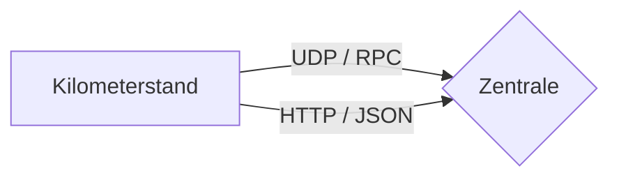

##### UDP / RPC

Der Sensor _Kilometerstand_ schickt ein Datagram über UDP and die Zentrale auf **Port 8004**. Der Inhalt des Datagrams ist eine mittels Protocol Buffers serialisierte Nachricht, welche die Messdaten des Sensors beinhaltet, sowie die Verbindungseigenschaften, welche nötig sind um die Nachricht an die Zentrale schicken zu können.

```yaml
Port: 8004
```

```protobuf
message Kilometerstand {
    required double mileage = 1;
    required string type = 2;
}
```

- mileage: Kilometerstand
- type: Art des Sensors

```protobuf
message KilometerstandToHeadquarter {
    required Kilometerstand data = 1;
    optional string from_address = 2;
    optional int32 from_port = 3;
    optional string to_address = 4;
    optional int32 to_port = 5;
    required uint64 send = 6;
    optional uint64 received = 7;
    optional uint64 latency = 8;
    optional uint64 round_trip = 9;
}
```

- data: Daten des Sensors
- from_address: Adresse des Senders
- from_port: Port des Senders
- to_address: Adresse des Empfängers
- to_port: Port des Empfängers
- send: Zeitpunkt an dem die Nachricht versendet wird.[^clock]
- received: Zeitpunkt an dem die Nachricht empfangen wird.[^clock]
- latency: Berechnete Latenz zwischen senden und empfangen der Nachricht. [^clock]
- round_trip: Gesamtdauer bis die Nachricht vom ersten Sender gesendet und vom letzten Empfänger empfangen wird.[^clock]

##### HTTP / JSON

Der Sensor _Kilometerstand_ fragt in der Simulation die aktuelle zurückgelegte Distanz des Sensors _Durchschnittsgeschwindigkeit_ über die Rest API der Zentrale ab. Um in der Simulation einen realistischen Wert für den Kilometerstand zu generieren.

```http
GET / HTTP/1.1
```

```json
{
  ...
  "durchschnittsgeschwindigkeit": {
    "accelerate": true,
    "acceleration": 0.16185306522628218,
    "average speed": 43.75087498656756,
    "breaking force": 1,
    "distance": 34.82812203174052,
    "max speed": 130,
    "min speed": 50,
    "speed": 41.7444430884444,
    "start time": 1611301664628575700,
    "type": "Durchschnittsgeschwindigkeit"
  },
  ...
}
```

#### Zentrale

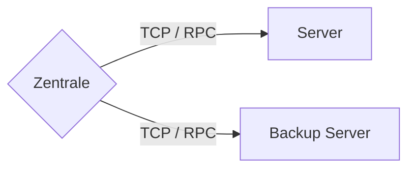

##### TCP / RPC

Die Zentrale synchronisiert die Messdaten der Sensoren mit einem der Servern. Dafür wird als Kommunikationsprotokoll TCP verwenden. Wenn über TCP die Verbindung aufgebaut ist, wird über den Stream neue bzw noch nicht synchronisierte daten übertragen. Sollten keine Daten vorhanden sein wird die TCP Verbindung geschlossen und erst wieder aufgemacht sollte es neue Daten zur Synchronisierung geben. Sollte es wahren der Synchronisierung zu einem Verbindungsabbruch kommen, wird ein alternativer Server zur Synchronisierung gesucht. Für jede Art von Sensordaten gibt es bei dem Server einen speziellen offenen Port.

###### Verkehrssituation

```yaml
port: 9000
```

```protobuf
message VerkehrssituationToServer {
    required VerkehrssituationToHeadquarter data = 1;
    optional string from_address = 2;
    optional int32 from_port = 3;
    optional string to_address = 4;
    optional int32 to_port = 5;
    required uint64 send = 6;
    optional uint64 received = 7;
    optional uint64 latency = 8;
    optional uint64 round_trip = 9;
}
```

- data: Daten des Sensors und Verbindungs Eigenschaften zwischen Zentrale und Server ([Mehr dazu](#verkehrssituation))
- from_address: Adresse des Senders
- from_port: Port des Senders
- to_address: Adresse des Empfängers
- to_port: Port des Empfängers
- send: Zeitpunkt an dem die Nachricht versendet wird.[^clock]
- received: Zeitpunkt an dem die Nachricht empfangen wird.[^clock]
- latency: Berechnete Latenz zwischen senden und empfangen der Nachricht. [^clock]
- round_trip: Gesamtdauer bis die Nachricht vom ersten Sender gesendet und vom letzten Empfänger empfangen wird.[^clock]

###### Durchschnittsgeschwindigkeit

```yaml
port: 9001
```

```protobuf
message DurchschnittsgeschwindigkeitToServer {
    required DurchschnittsgeschwindigkeitToHeadquarter data = 1;
    optional string from_address = 2;
    optional int32 from_port = 3;
    optional string to_address = 4;
    optional int32 to_port = 5;
    required uint64 send = 6;
    optional uint64 received = 7;
    optional uint64 latency = 8;
    optional uint64 round_trip = 9;
}
```

- data: Daten des Sensors und Verbindungs Eigenschaften zwischen Zentrale und Server ([Mehr dazu](#durchschnittsgeschwindigkeit))
- from_address: Adresse des Senders
- from_port: Port des Senders
- to_address: Adresse des Empfängers
- to_port: Port des Empfängers
- send: Zeitpunkt an dem die Nachricht versendet wird.[^clock]
- received: Zeitpunkt an dem die Nachricht empfangen wird.[^clock]
- latency: Berechnete Latenz zwischen senden und empfangen der Nachricht. [^clock]
- round_trip: Gesamtdauer bis die Nachricht vom ersten Sender gesendet und vom letzten Empfänger empfangen wird.[^clock]

###### Kilometerstand

```yaml
port: 9002
```

```protobuf
message KilometerstandToServer {
    required KilometerstandToHeadquarter data = 1;
    optional string from_address = 2;
    optional int32 from_port = 3;
    optional string to_address = 4;
    optional int32 to_port = 5;
    required uint64 send = 6;
    optional uint64 received = 7;
    optional uint64 latency = 8;
    optional uint64 round_trip = 9;
}
```

- data: Daten des Sensors und Verbindungs Eigenschaften zwischen Zentrale und Server ([Mehr dazu](#kilometerstand))
- from_address: Adresse des Senders
- from_port: Port des Senders
- to_address: Adresse des Empfängers
- to_port: Port des Empfängers
- send: Zeitpunkt an dem die Nachricht versendet wird.[^clock]
- received: Zeitpunkt an dem die Nachricht empfangen wird.[^clock]
- latency: Berechnete Latenz zwischen senden und empfangen der Nachricht. [^clock]
- round_trip: Gesamtdauer bis die Nachricht vom ersten Sender gesendet und vom letzten Empfänger empfangen wird.[^clock]

###### Fuellstand

```yaml
port: 9003
```

```protobuf
message FuellstandToServer {
    required FuellstandToHeadquarter data = 1;
    optional string from_address = 2;
    optional int32 from_port = 3;
    optional string to_address = 4;
    optional int32 to_port = 5;
    required uint64 send = 6;
    optional uint64 received = 7;
    optional uint64 latency = 8;
    optional uint64 round_trip = 9;
}
```

- data: Daten des Sensors und Verbindungs Eigenschaften zwischen Zentrale und Server ([Mehr dazu](#füllstand))
- from_address: Adresse des Senders
- from_port: Port des Senders
- to_address: Adresse des Empfängers
- to_port: Port des Empfängers
- send: Zeitpunkt an dem die Nachricht versendet wird.[^clock]
- received: Zeitpunkt an dem die Nachricht empfangen wird.[^clock]
- latency: Berechnete Latenz zwischen senden und empfangen der Nachricht. [^clock]
- round_trip: Gesamtdauer bis die Nachricht vom ersten Sender gesendet und vom letzten Empfänger empfangen wird.[^clock]

#### Server

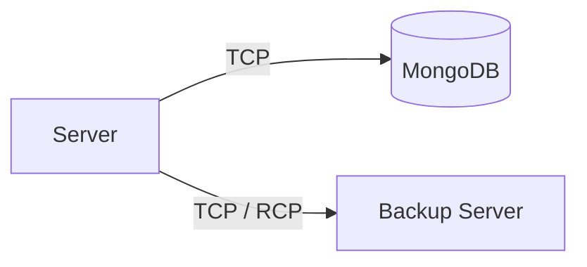

##### Persistenz

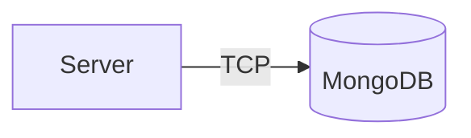

Der Server persistiert die empfangenen Daten mit der Datenbank. Als Datenbank wird [MongoDB](https://www.mongodb.com/de) verwendet;

```json
"mongodb://mongodb:27017"
```

##### Synchronisation

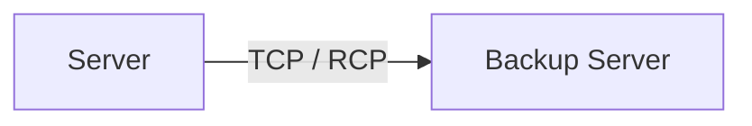

Der Server synchronisiert die empfangenen Daten mit dem Backup Server.

###### Verkehrssituation

```yaml
Port: 9004
```

```protobuf
message VerkehrssituationFromServer {
    required VerkehrssituationToServer data = 1;
    optional string from_address = 2;
    optional int32 from_port = 3;
    optional string to_address = 4;
    optional int32 to_port = 5;
    required uint64 send = 6;
    optional uint64 received = 7;
    optional uint64 latency = 8;
    optional uint64 round_trip = 9;
}
```

- data: Daten des Sensors und Verbindungs Eigenschaften zwischen Server und Server ([Mehr dazu](#Verkehrssituation))
- from_address: Adresse des Senders
- from_port: Port des Senders
- to_address: Adresse des Empfängers
- to_port: Port des Empfängers
- send: Zeitpunkt an dem die Nachricht versendet wird.[^clock]
- received: Zeitpunkt an dem die Nachricht empfangen wird.[^clock]
- latency: Berechnete Latenz zwischen senden und empfangen der Nachricht. [^clock]
- round_trip: Gesamtdauer bis die Nachricht vom ersten Sender gesendet und vom letzten Empfänger empfangen wird.[^clock]

###### Durchschnittsgeschwindigkeit

```yaml
Port: 9005
```

```protobuf
message DurchschnittsgeschwindigkeitFromServer {
    required DurchschnittsgeschwindigkeitToServer data = 1;
    optional string from_address = 2;
    optional int32 from_port = 3;
    optional string to_address = 4;
    optional int32 to_port = 5;
    required uint64 send = 6;
    optional uint64 received = 7;
    optional uint64 latency = 8;
    optional uint64 round_trip = 9;
}
```

- data: Daten des Sensors und Verbindungs Eigenschaften zwischen Server und Server ([Mehr dazu](#Durchschnittsgeschwindigkeit))
- from_address: Adresse des Senders
- from_port: Port des Senders
- to_address: Adresse des Empfängers
- to_port: Port des Empfängers
- send: Zeitpunkt an dem die Nachricht versendet wird.[^clock]
- received: Zeitpunkt an dem die Nachricht empfangen wird.[^clock]
- latency: Berechnete Latenz zwischen senden und empfangen der Nachricht. [^clock]
- round_trip: Gesamtdauer bis die Nachricht vom ersten Sender gesendet und vom letzten Empfänger empfangen wird.[^clock

###### Kilometerstand

```yaml
Port: 9006
```

```protobuf
message KilometerstandFromServer {
    required KilometerstandToServer data = 1;
    optional string from_address = 2;
    optional int32 from_port = 3;
    optional string to_address = 4;
    optional int32 to_port = 5;
    required uint64 send = 6;
    optional uint64 received = 7;
    optional uint64 latency = 8;
    optional uint64 round_trip = 9;
}
```

- data: Daten des Sensors und Verbindungs Eigenschaften zwischen Server und Server ([Mehr dazu](#Kilometerstand))
- from_address: Adresse des Senders
- from_port: Port des Senders
- to_address: Adresse des Empfängers
- to_port: Port des Empfängers
- send: Zeitpunkt an dem die Nachricht versendet wird.[^clock]
- received: Zeitpunkt an dem die Nachricht empfangen wird.[^clock]
- latency: Berechnete Latenz zwischen senden und empfangen der Nachricht. [^clock]
- round_trip: Gesamtdauer bis die Nachricht vom ersten Sender gesendet und vom letzten Empfänger empfangen wird.[^clock

###### Fuellstand

```yaml
Port: 9007
```

```protobuf
message FuellstandFromServer {
    required FuellstandToServer data = 1;
    optional string from_address = 2;
    optional int32 from_port = 3;
    optional string to_address = 4;
    optional int32 to_port = 5;
    required uint64 send = 6;
    optional uint64 received = 7;
    optional uint64 latency = 8;
    optional uint64 round_trip = 9;
}
```

- data: Daten des Sensors und Verbindungs Eigenschaften zwischen Server und Server ([Mehr dazu](#Füllstand))
- from_address: Adresse des Senders
- from_port: Port des Senders
- to_address: Adresse des Empfängers
- to_port: Port des Empfängers
- send: Zeitpunkt an dem die Nachricht versendet wird.[^clock]
- received: Zeitpunkt an dem die Nachricht empfangen wird.[^clock]
- latency: Berechnete Latenz zwischen senden und empfangen der Nachricht. [^clock]
- round_trip: Gesamtdauer bis die Nachricht vom ersten Sender gesendet und vom letzten Empfänger empfangen wird.[^clock]

#### Backup Server

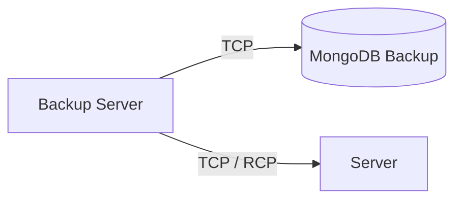

##### Persistenz

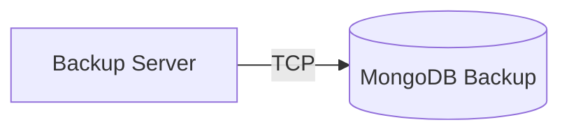

Der Server persistiert die empfangenen Daten mit der Datenbank. Als Datenbank wird [MongoDB](https://www.mongodb.com/de) verwendet;

```json
"mongodb://mongodb_backup:27017"
```

##### Synchronisation

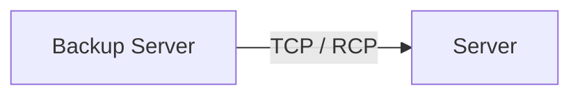

Der Server synchronisiert die empfangenen Daten mit dem Backup Server.

###### Verkehrssituation

```yaml
Port: 9004
```

```protobuf
message VerkehrssituationFromServer {
    required VerkehrssituationToServer data = 1;
    optional string from_address = 2;
    optional int32 from_port = 3;
    optional string to_address = 4;
    optional int32 to_port = 5;
    required uint64 send = 6;
    optional uint64 received = 7;
    optional uint64 latency = 8;
    optional uint64 round_trip = 9;
}
```

- data: Daten des Sensors und Verbindungs Eigenschaften zwischen Server und Server ([Mehr dazu](#Verkehrssituation))
- from_address: Adresse des Senders
- from_port: Port des Senders
- to_address: Adresse des Empfängers
- to_port: Port des Empfängers
- send: Zeitpunkt an dem die Nachricht versendet wird.[^clock]
- received: Zeitpunkt an dem die Nachricht empfangen wird.[^clock]
- latency: Berechnete Latenz zwischen senden und empfangen der Nachricht. [^clock]
- round_trip: Gesamtdauer bis die Nachricht vom ersten Sender gesendet und vom letzten Empfänger empfangen wird.[^clock]

###### Durchschnittsgeschwindigkeit

```yaml
Port: 9005
```

```protobuf
message DurchschnittsgeschwindigkeitFromServer {
    required DurchschnittsgeschwindigkeitToServer data = 1;
    optional string from_address = 2;
    optional int32 from_port = 3;
    optional string to_address = 4;
    optional int32 to_port = 5;
    required uint64 send = 6;
    optional uint64 received = 7;
    optional uint64 latency = 8;
    optional uint64 round_trip = 9;
}
```

- data: Daten des Sensors und Verbindungs Eigenschaften zwischen Server und Server ([Mehr dazu](#Durchschnittsgeschwindigkeit))
- from_address: Adresse des Senders
- from_port: Port des Senders
- to_address: Adresse des Empfängers
- to_port: Port des Empfängers
- send: Zeitpunkt an dem die Nachricht versendet wird.[^clock]
- received: Zeitpunkt an dem die Nachricht empfangen wird.[^clock]
- latency: Berechnete Latenz zwischen senden und empfangen der Nachricht. [^clock]
- round_trip: Gesamtdauer bis die Nachricht vom ersten Sender gesendet und vom letzten Empfänger empfangen wird.[^clock

###### Kilometerstand

```yaml
Port: 9006
```

```protobuf
message KilometerstandFromServer {
    required KilometerstandToServer data = 1;
    optional string from_address = 2;
    optional int32 from_port = 3;
    optional string to_address = 4;
    optional int32 to_port = 5;
    required uint64 send = 6;
    optional uint64 received = 7;
    optional uint64 latency = 8;
    optional uint64 round_trip = 9;
}
```

- data: Daten des Sensors und Verbindungs Eigenschaften zwischen Server und Server ([Mehr dazu](#Kilometerstand))
- from_address: Adresse des Senders
- from_port: Port des Senders
- to_address: Adresse des Empfängers
- to_port: Port des Empfängers
- send: Zeitpunkt an dem die Nachricht versendet wird.[^clock]
- received: Zeitpunkt an dem die Nachricht empfangen wird.[^clock]
- latency: Berechnete Latenz zwischen senden und empfangen der Nachricht. [^clock]
- round_trip: Gesamtdauer bis die Nachricht vom ersten Sender gesendet und vom letzten Empfänger empfangen wird.[^clock

###### Fuellstand

```yaml
Port: 9007
```

```protobuf
message FuellstandFromServer {
    required FuellstandToServer data = 1;
    optional string from_address = 2;
    optional int32 from_port = 3;
    optional string to_address = 4;
    optional int32 to_port = 5;
    required uint64 send = 6;
    optional uint64 received = 7;
    optional uint64 latency = 8;
    optional uint64 round_trip = 9;
}
```

- data: Daten des Sensors und Verbindungs Eigenschaften zwischen Server und Server ([Mehr dazu](#Füllstand))
- from_address: Adresse des Senders
- from_port: Port des Senders
- to_address: Adresse des Empfängers
- to_port: Port des Empfängers
- send: Zeitpunkt an dem die Nachricht versendet wird.[^clock]
- received: Zeitpunkt an dem die Nachricht empfangen wird.[^clock]
- latency: Berechnete Latenz zwischen senden und empfangen der Nachricht. [^clock]
- round_trip: Gesamtdauer bis die Nachricht vom ersten Sender gesendet und vom letzten Empfänger empfangen wird.[^clock]

#### Web-Browser

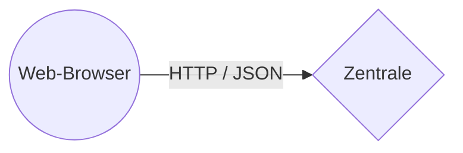

##### REST

Die Zentrale hat eine REST API integriert auf Port 8081.

###### Alle Sensoren

Fragt die letzten Daten aller Sensoren ab.

```http
GET / HTTP/1.1
```

```json
{
  "durchschnittsgeschwindigkeit": {
    "accelerate": false,
    "acceleration": 0.7517730846835802,
    "average speed": 44.99221214788684,
    "breaking force": 2.051165420830732,
    "distance": 0.2012729584920854,
    "max speed": 20,
    "min speed": 7,
    "speed": 41.77508150129822,
    "start time": 1611695595676618200,
    "type": "Durchschnittsgeschwindigkeit"
  },
  "fuellstand": {
    "capacity": 70.32155064451707,
    "consumption": 26.70017179989159,
    "current capacity": 70.32109007555954,
    "last refueld": 0,
    "level": 0.999993450528987,
    "type": "Fuellstand",
    "ussage": 0.00005374022570411129,
    "will refill": 26.352919361965316
  },
  "kilometerstand": {
    "mileage": 4251.649376081224,
    "type": "Kilometerstand"
  },
  "time": 1611695612409651500,
  "verkehrssituation": {
    "numeric value": 5,
    "rising": false,
    "type": "Verkehrssituation",
    "value": "Stau"
  }
}
```

###### Fuellstand History

Fragt die letzten 1000 Daten des Sensors Fuellstand ab.

```http
GET /fuellstand HTTP/1.1
```

```json
{
  "data": [
    {
      "capacity": 70.32155064451707,
      "consumption": 26.70017179989159,
      "current capacity": 70.32155064451678,
      "last refueld": 0,
      "level": 0.9999999999999958,
      "type": "Fuellstand",
      "ussage": 3.020096180631755e-13,
      "will refill": 29.066033133726943
    }
  ],
  "time": 1611696275323451100
}
```

###### Fuellstand Daten einzeln

Fragt einen bestimmten Wert des Sensors ab.

```http
GET /fuellstand/{index} HTTP/1.1
```

```json
{
  "data": {
    "capacity": 70.32155064451707,
    "consumption": 26.70017179989159,
    "current capacity": 70.32154743364363,
    "last refueld": 0,
    "level": 0.9999999543401217,
    "type": "Fuellstand",
    "ussage": 0.0000032108731400202195,
    "will refill": 6.631021289481147
  },
  "time": 1611696275323451100
}
```

###### Durchschnittsgeschwindigkeit History

Fragt die letzten 1000 Daten des Sensors Durchschnittsgeschwindigkeit ab.

```http
GET /durchschnittsgeschwindigkeit HTTP/1.1
```

```json
{
  "data": [
    {
      "accelerate": true,
      "acceleration": -0.555546157778583,
      "average speed": 5.817162275615268,
      "breaking force": 1,
      "distance": 1.131114886925191e-9,
      "max speed": 260,
      "min speed": 130,
      "speed": 40.72013592930688,
      "start time": 1611695595676618200,
      "type": "Durchschnittsgeschwindigkeit"
    }
  ],
  "time": 1611696275323451100
}
```

###### Durchschnittsgeschwindigkeit Daten einzeln

Fragt einen bestimmten Wert des Sensors ab.

```http
GET /durchschnittsgeschwindigkeit/{index} HTTP/1.1
```

```json
{
  "data": {
    "accelerate": true,
    "acceleration": -0.555546157778583,
    "average speed": 5.817162275615268,
    "breaking force": 1,
    "distance": 1.131114886925191e-9,
    "max speed": 260,
    "min speed": 130,
    "speed": 40.72013592930688,
    "start time": 1611695595676618200,
    "type": "Durchschnittsgeschwindigkeit"
  },
  "time": 1611696275323451100
}
```

###### Kilometerstand History

Fragt die letzten 1000 Daten des Sensors Kilometerstand ab.

```http
GET /kilometerstand HTTP/1.1
```

```json
{
  "data": [
    {
      "mileage": 4251.649376081224,
      "type": "Kilometerstand"
    }
  ],
  "time": 1611696275323451100
}
```

###### Kilometerstand Daten einzeln

Fragt einen bestimmten Wert des Sensors ab.

```http
GET /durchschnittsgeschwindigkeit/{index} HTTP/1.1
```

```json
{
  "data": {
    "mileage": 4251.649376081224,
    "type": "Kilometerstand"
  },
  "time": 1611696275323451100
}
```

###### Verkehrssituation History

Fragt die letzten 1000 Daten des Sensors Verkehrssituation ab.

```http
GET /verkehrssituation HTTP/1.1
```

```json
{
  "data": [
    {
      "numeric value": 5,
      "rising": false,
      "type": "Verkehrssituation",
      "value": "Stau"
    }
  ],
  "time": 1611696275323451100
}
```

###### Verkehrssituation Daten einzeln

Fragt einen bestimmten Wert des Sensors ab.

```http
GET /verkehrssituation/{index} HTTP/1.1
```

```json
{
  "data": {
    "numeric value": 5,
    "rising": false,
    "type": "Verkehrssituation",
    "value": "Stau"
  },
  "time": 1611696275323451100
}
```

### MQTT

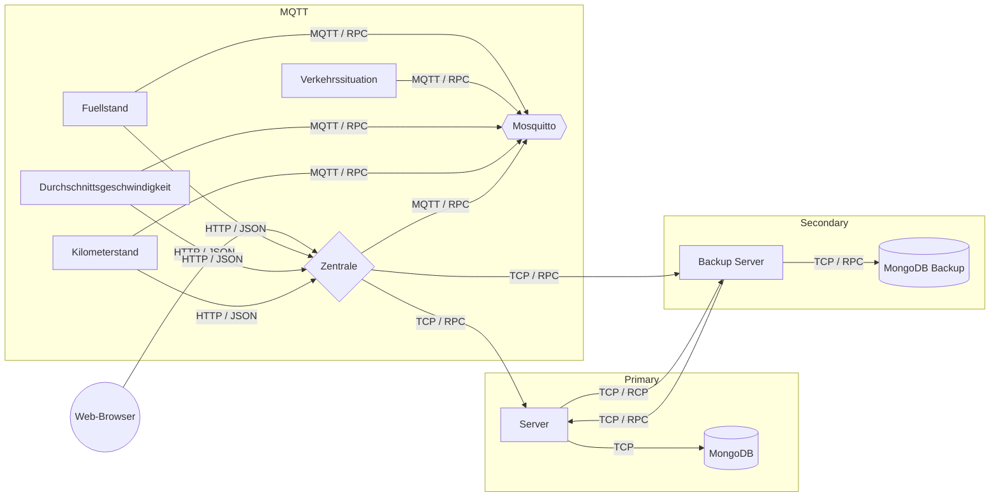

#### Füllstand

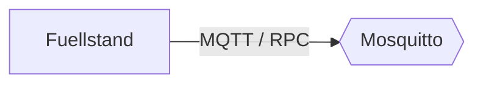

Sendet die Daten statt zuvor direkt an die Zentrale jetzt an den MQTT Broker Mosquitto. \
[Mehr](#Füllstand)

#### Verkehrssituation

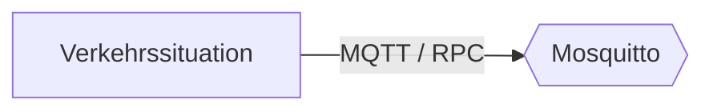

Sendet die Daten statt zuvor direkt an die Zentrale jetzt an den MQTT Broker Mosquitto. \
[Mehr](#Verkehrssituation)

#### Durchschnittsgeschwindigkeit

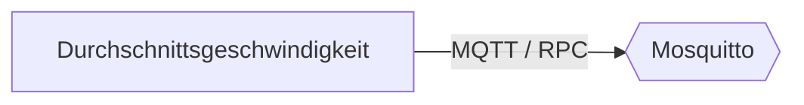

Sendet die Daten statt zuvor direkt an die Zentrale jetzt an den MQTT Broker Mosquitto. \
[Mehr](#Durchschnittsgeschwindigkeit)

#### Kilometerstand

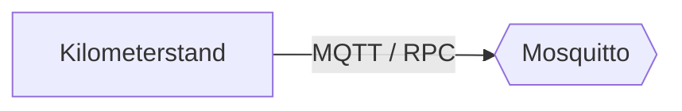

Sendet die Daten statt zuvor direkt an die Zentrale jetzt an den MQTT Broker Mosquitto. \
[Mehr](#Kilometerstand)

#### Zentrale

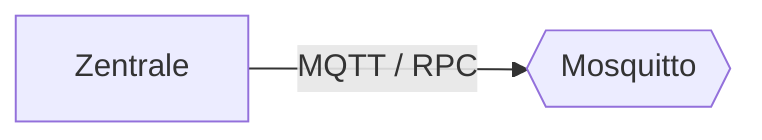

Sendet die Daten statt zuvor direkt an die Zentrale jetzt an den MQTT Broker Mosquitto. \
[Mehr](#Zentrale)

[^clock]: Uhrenfehler (Clock drift) werden in der Simulation nicht berücksichtigt.

## Tests

### Durchschnittsgeschwindigkeit

#### Funktionale Tests

##### Unit Test

###### Testszenario

Die generierung der Nachricht des Sensors wird automatisch durch gTests auf funktionalität und vollständigkeit getestet.

###### Testcase

Es wird ueberprueft ob alle Felder die in dem RPC protocol fuer den Austausch zwischen Sensor Fuellstand und der Zentrale benötigt werden ausgefüllt sind.

###### Testausführung

Der Test wird automatisch mittels gTest entweder direkt im container mittels ter test-suit cTest oder mittels ``docker-compose -f docker-compose.yml -f docker-compose.test.yml up --build`

###### Testresultat

Der Test wird fehlerfrei ausgeführt wenn der Container Zentrale gestartet ist. Andernfalls schlägt der DNS-Lookup fehl.

##### Integartionstest

###### Testszenario

###### Testcase

Es wird ueberprueft ob der Austausch der Daten zwischen dem Sensor und der Zentrale richtig funktioniert

###### Testausführung

Die Sensoren werden manuell in den Devcontainern gestartet und es wird mit hilfe des Debuggers geschaut das alle Daten richtig bei der Zentrale ankommen.

###### Testresultat

Es kommen alle Daten wie geplant bei der Zentrale an.

#### Performance Tests

##### Stress Test

###### Testszenario

Mittels der Environment Variable wird die Rate in der der Sensor Daten an die Zentrale schickt veraendert und es wird ueberprueft ob alle Daten bei der Zentrale ankommen. Dies geschieht in voll betrieb so wie nur Sensor und Zentrale, sowie alle notwendigen Container fuer den Datenaustausch.

###### Testcase

Es wird ueberprueft das alle Daten an bei der Zentrale ankommen.

###### Testausführung

Es werden Verschiedene Zeitabstaende getestet (2000ms, 1000, 100, 10, 1). Es wird mittels debugger und eines tools zum vergleichen der log ausgabe der Zentrale und Sensor (git diff) ueberprueft ob alle Daten bei der Zentrale ankommen.

###### Testresultat

Es kommen alle Nachrichten bei der Zentrale an, es kommst aber bei geringeren Zeitabstaenden zu erhöhter CPU wie RAM auslastung.

##### Speed Test

###### Testszenario

Es wird die Zeitueberprueft wie lange der Sensor braucht bis seine Nachricht an den Server geschickt wird.

###### Testcase

Es wird von mehreren Nachrichten die Zeitspanne ueberprueft, bis die Nachricht bei der Zentrale ankommt. Dies geschieht unter vollbetrieb so wie nur Zentrale und Sensor, sowie alle notwendigen Container zur Datenuebermittlung.

###### Testausführung

Mittels `docker-compose` werden alle container im normal betrieb sowie als devcontainer gestartet. Der Konsolen Log wird verglichen sowie die Datenbank Eintraege.

###### Testresultat

Der Sensor brauch nur wenige Nanosekunden (200-2000ns) fuer den austausch der Daten, es sei den ein mutex blockiert das ausfuehren eines bestimmten code abschnittes (500ms-5s).

### Fuellstand

#### Funktionale Tests

##### Unit Test

###### Testszenario

Die generierung der Nachricht des Sensors wird automatisch durch gTests auf funktionalität und vollständigkeit getestet.

###### Testcase

Es wird ueberprueft ob alle Felder die in dem RPC protocol fuer den Austausch zwischen Sensor Fuellstand und der Zentrale benötigt werden ausgefüllt sind.

###### Testausführung

Der Test wird automatisch mittels gTest entweder direkt im container mittels ter test-suit cTest oder mittels ``docker-compose -f docker-compose.yml -f docker-compose.test.yml up --build`

###### Testresultat

Der Test wird fehlerfrei ausgeführt wenn der Container Zentrale gestartet ist. Andernfalls schlägt der DNS-Lookup fehl.

##### Integartionstest

###### Testszenario

###### Testcase

Es wird ueberprueft ob der Austausch der Daten zwischen dem Sensor und der Zentrale richtig funktioniert

###### Testausführung

Die Sensoren werden manuell in den Devcontainern gestartet und es wird mit hilfe des Debuggers geschaut das alle Daten richtig bei der Zentrale ankommen.

###### Testresultat

Es kommen alle Daten wie geplant bei der Zentrale an.

#### Performance Tests

##### Stress Test

###### Testszenario

Mittels der Environment Variable wird die Rate in der der Sensor Daten an die Zentrale schickt veraendert und es wird ueberprueft ob alle Daten bei der Zentrale ankommen. Dies geschieht in voll betrieb so wie nur Sensor und Zentrale, sowie alle notwendigen Container fuer den Datenaustausch.

###### Testcase

Es wird ueberprueft das alle Daten an bei der Zentrale ankommen.

###### Testausführung

Es werden Verschiedene Zeitabstaende getestet (2000ms, 1000, 100, 10, 1). Es wird mittels debugger und eines tools zum vergleichen der log ausgabe der Zentrale und Sensor (git diff) ueberprueft ob alle Daten bei der Zentrale ankommen.

###### Testresultat

Es kommen alle Nachrichten bei der Zentrale an, es kommst aber bei geringeren Zeitabstaenden zu erhöhter CPU wie RAM auslastung.

##### Speed Test

###### Testszenario

Es wird die Zeitueberprueft wie lange der Sensor braucht bis seine Nachricht an den Server geschickt wird.

###### Testcase

Es wird von mehreren Nachrichten die Zeitspanne ueberprueft, bis die Nachricht bei der Zentrale ankommt. Dies geschieht unter vollbetrieb so wie nur Zentrale und Sensor, sowie alle notwendigen Container zur Datenuebermittlung.

###### Testausführung

Mittels `docker-compose` werden alle container im normal betrieb sowie als devcontainer gestartet. Der Konsolen Log wird verglichen sowie die Datenbank Eintraege.

###### Testresultat

Der Sensor brauch nur wenige Nanosekunden (200-2000ns) fuer den austausch der Daten, es sei den ein mutex blockiert das ausfuehren eines bestimmten code abschnittes (500ms-5s)

### Kilometerstand

#### Funktionale Tests

##### Unit Test

###### Testszenario

Die generierung der Nachricht des Sensors wird automatisch durch gTests auf funktionalität und vollständigkeit getestet.

###### Testcase

Es wird ueberprueft ob alle Felder die in dem RPC protocol fuer den Austausch zwischen Sensor Fuellstand und der Zentrale benötigt werden ausgefüllt sind.

###### Testausführung

Der Test wird automatisch mittels gTest entweder direkt im container mittels ter test-suit cTest oder mittels ``docker-compose -f docker-compose.yml -f docker-compose.test.yml up --build`

###### Testresultat

Der Test wird fehlerfrei ausgeführt wenn der Container Zentrale gestartet ist. Andernfalls schlägt der DNS-Lookup fehl.

##### Integartionstest

###### Testszenario

###### Testcase

Es wird ueberprueft ob der Austausch der Daten zwischen dem Sensor und der Zentrale richtig funktioniert

###### Testausführung

Die Sensoren werden manuell in den Devcontainern gestartet und es wird mit hilfe des Debuggers geschaut das alle Daten richtig bei der Zentrale ankommen.

###### Testresultat

Es kommen alle Daten wie geplant bei der Zentrale an.

#### Performance Tests

##### Stress Test

###### Testszenario

Mittels der Environment Variable wird die Rate in der der Sensor Daten an die Zentrale schickt veraendert und es wird ueberprueft ob alle Daten bei der Zentrale ankommen. Dies geschieht in voll betrieb so wie nur Sensor und Zentrale, sowie alle notwendigen Container fuer den Datenaustausch.

###### Testcase

Es wird ueberprueft das alle Daten an bei der Zentrale ankommen.

###### Testausführung

Es werden Verschiedene Zeitabstaende getestet (2000ms, 1000, 100, 10, 1). Es wird mittels debugger und eines tools zum vergleichen der log ausgabe der Zentrale und Sensor (git diff) ueberprueft ob alle Daten bei der Zentrale ankommen.

###### Testresultat

Es kommen alle Nachrichten bei der Zentrale an, es kommst aber bei geringeren Zeitabstaenden zu erhöhter CPU wie RAM auslastung.

##### Speed Test

###### Testszenario

Es wird die Zeitueberprueft wie lange der Sensor braucht bis seine Nachricht an den Server geschickt wird.

###### Testcase

Es wird von mehreren Nachrichten die Zeitspanne ueberprueft, bis die Nachricht bei der Zentrale ankommt. Dies geschieht unter vollbetrieb so wie nur Zentrale und Sensor, sowie alle notwendigen Container zur Datenuebermittlung.

###### Testausführung

Mittels `docker-compose` werden alle container im normal betrieb sowie als devcontainer gestartet. Der Konsolen Log wird verglichen sowie die Datenbank Eintraege.

###### Testresultat

Der Sensor brauch nur wenige Nanosekunden (200-2000ns) fuer den austausch der Daten, es sei den ein mutex blockiert das ausfuehren eines bestimmten code abschnittes (500ms-5s)

### Verkehrssituation

#### Funktionale Tests

##### Unit Test

###### Testszenario

Die generierung der Nachricht des Sensors wird automatisch durch gTests auf funktionalität und vollständigkeit getestet.

###### Testcase

Es wird ueberprueft ob alle Felder die in dem RPC protocol fuer den Austausch zwischen Sensor Fuellstand und der Zentrale benötigt werden ausgefüllt sind.

###### Testausführung

Der Test wird automatisch mittels gTest entweder direkt im container mittels ter test-suit cTest oder mittels ``docker-compose -f docker-compose.yml -f docker-compose.test.yml up --build`

###### Testresultat

Der Test wird fehlerfrei ausgeführt wenn der Container Zentrale gestartet ist. Andernfalls schlägt der DNS-Lookup fehl.

##### Integartionstest

###### Testszenario

###### Testcase

Es wird ueberprueft ob der Austausch der Daten zwischen dem Sensor und der Zentrale richtig funktioniert

###### Testausführung

Die Sensoren werden manuell in den Devcontainern gestartet und es wird mit hilfe des Debuggers geschaut das alle Daten richtig bei der Zentrale ankommen.

###### Testresultat

Es kommen alle Daten wie geplant bei der Zentrale an.

#### Performance Tests

##### Stress Test

###### Testszenario

Mittels der Environment Variable wird die Rate in der der Sensor Daten an die Zentrale schickt veraendert und es wird ueberprueft ob alle Daten bei der Zentrale ankommen. Dies geschieht in voll betrieb so wie nur Sensor und Zentrale, sowie alle notwendigen Container fuer den Datenaustausch.

###### Testcase

Es wird ueberprueft das alle Daten an bei der Zentrale ankommen.

###### Testausführung

Es werden Verschiedene Zeitabstaende getestet (2000ms, 1000, 100, 10, 1). Es wird mittels debugger und eines tools zum vergleichen der log ausgabe der Zentrale und Sensor (git diff) ueberprueft ob alle Daten bei der Zentrale ankommen.

###### Testresultat

Es kommen alle Nachrichten bei der Zentrale an, es kommst aber bei geringeren Zeitabstaenden zu erhöhter CPU wie RAM auslastung.

##### Speed Test

###### Testszenario

Es wird die Zeitueberprueft wie lange der Sensor braucht bis seine Nachricht an den Server geschickt wird.

###### Testcase

Es wird von mehreren Nachrichten die Zeitspanne ueberprueft, bis die Nachricht bei der Zentrale ankommt. Dies geschieht unter vollbetrieb so wie nur Zentrale und Sensor, sowie alle notwendigen Container zur Datenuebermittlung.

###### Testausführung

Mittels `docker-compose` werden alle container im normal betrieb sowie als devcontainer gestartet. Der Konsolen Log wird verglichen sowie die Datenbank Eintraege.

###### Testresultat

Der Sensor brauch nur wenige Nanosekunden (200-2000ns) fuer den austausch der Daten, es sei den ein mutex blockiert das ausfuehren eines bestimmten code abschnittes (500ms-5s)

### Zentrale

#### Funktionale Tests

##### Integartionstest

###### Testszenario
Bei der Zentrale wird ueberprueft das der Datenaustausch zwischen den Sensoren, dem Server und dem Backup Sever funktioniert, sowie die Funktionalität der REST API

###### Testcase
Es wird ueberprueft das die Daten der Sensoren bei der Zentrale ankommen und mit dem Server und dem Backup Server generiert werden. Ausserdem wird ueberprueft ob alle Paths die in der REST API angegeben sind funktionieren.

###### Testausführung
Datenbanken in Backend werden überprüft ob alle Daten in der Datenbank ankommen.
Ausserdem werden GET Anfragen fuer jede spezifizierte URI in der REST API vorgenommen.

###### Testresultat
Alle Daten kommen an dem Server an und die REST API funktioniert.

#### Performance Tests

##### Stress Test

###### Testszenario
Alle Sensoren senden auf einem schnellen Intervall ihre Daten an die Zentrale.

###### Testcase
Es wird ueberprueft ob auch bei der hohen Auslastung alle Daten bei der Datenbank ankommen.

###### Testausführung
Die Sensoren werden mit hoher send rate ausgefuert, und es wird ueberpruefet ob alle Daten in der Datenbank ankommen

###### Testresultat
Es kommen alle Daten bei der Datenbank an 

##### Speed Test

###### Testszenario
Die Daten haben Zeitstempel.

###### Testcase
Es wird die Zeitgemessen die Daten der Sensoren brauchen bis sie zur Zentrale geschickt werden, sowie zu dem Sever und dem Backend Server.

###### Testausführung
Es werden die Daten in der Datenbank ueberprueft

###### Testresultat
Alles funktioniert

### Server

#### Funktionale Tests

##### Integartionstest

###### Testszenario
Die Daten der Zentrale werden an den Server geschickt und mit dem Backup Server synchronisiert.

###### Testcase
Es wird ueberprueft ob der Datenaustausch funktioniert.

###### Testausführung
Die Sensoren so wie alle weiteren Kommunikations Systeme laufene unter normalbetrieb sowie einzelne Sensoren laufen. Und es werden die Datenbank eintrage ueberprueft.

###### Testresultat
Der Datenaustausch funktioniert

#### Performance Tests

##### Stress Test

###### Testszenario
Unter hoher sende raten der Sensoren wird getestet ob der Datenaustausch immer noch funktioniert.

###### Testcase
Die Sensoren senden unter einer hohern sende rate seine Daten an die Zentrale, sowie die Zentrale sendet mit hoeherer rate an die Server.

###### Testausführung
Die Sensoren werden mit hoher senderate gestarted und es werden die Datenbank eintrage untersucht 

###### Testresultat
Funktioniert

### Backup Server

#### Funktionale Tests

##### Integartionstest

###### Testszenario
Die Daten der Zentrale werden an den Server geschickt und mit dem Backup Server synchronisiert.

###### Testcase
Es wird ueberprueft ob der Datenaustausch funktioniert.

###### Testausführung
Die Sensoren so wie alle weiteren Kommunikations Systeme laufene unter normalbetrieb sowie einzelne Sensoren laufen. Und es werden die Datenbank eintrage ueberprueft.

###### Testresultat
Der Datenaustausch funktioniert

#### Performance Tests

##### Stress Test

###### Testszenario
Unter hoher sende raten der Sensoren wird getestet ob der Datenaustausch immer noch funktioniert.

###### Testcase
Die Sensoren senden unter einer hohern sende rate seine Daten an die Zentrale, sowie die Zentrale sendet mit hoeherer rate an die Server.

###### Testausführung
Die Sensoren werden mit hoher senderate gestarted und es werden die Datenbank eintrage untersucht 

###### Testresultat
Funktioniert